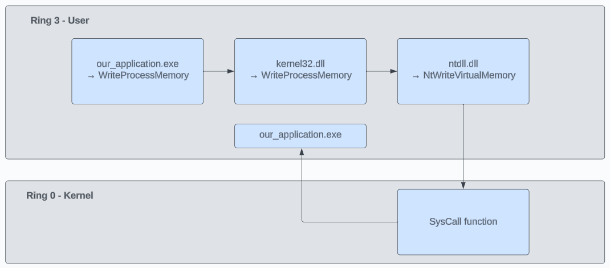
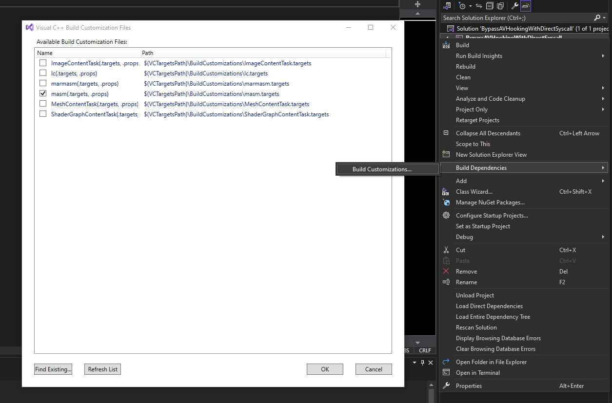
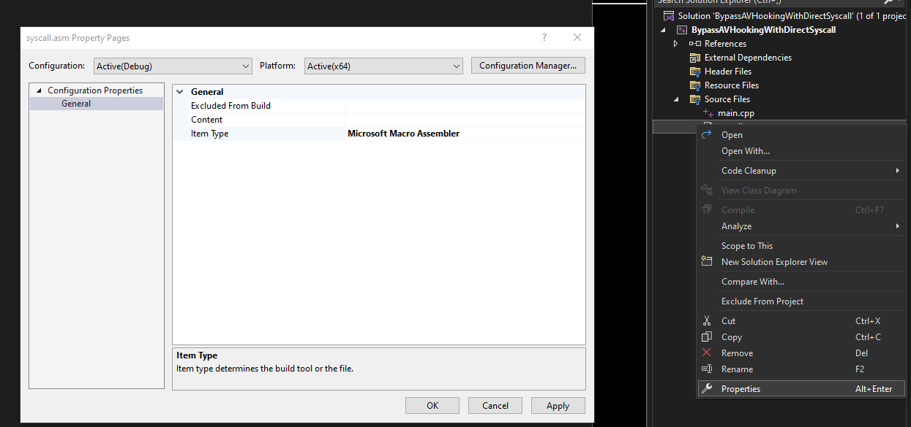

## Bypass AV Hooking with Direct Syscall

### Table of Content
1. [Giới thiệu](#giới-thiệu)
2. [WinAPI Hooking](#winapi-hooking)
3. [Lấy mã máy syscall API](#get-asm-syscall)
3. [Setup VS2022 để code ASM](#setup-vs2022-để-code-asm)
4. [Code](#code)


### Giới thiệu <a name = "giới-thiệu"></a>
Khi viết mã độc trên Windows, điều chúng ta sử dụng các WinAPI là không thể tránh khỏi. Tuy nhiên việc sử dụng các API cần phải thực hiện 1 cách lén lút nếu không sẽ rất
dễ dàng bị các trình AV phát hiện. Một trong những kĩ thuật để phát hiện hành vi của các API mà AV sử dụng đó là Hook API. Bài viết sẽ giải thích cách Hook API hoạt động
và làm sao để bypass việc Hook của AV bằng Direct Syscall.

### WinAPI Hooking
Khi 1 chương trình gọi đến API, nó thực hiện các bước theo sơ đồ dưới đây.


Tuy nhiên, 1 số API sử dụng cơ chế Hook để theo dõi xem API . Cơ chế hook API ở userland mình để link blog của iredteam tại đây: https://www.ired.team/offensive-security/code-injection-process-injection/how-to-hook-windows-api-using-c++.


Để bypass quá trình này, chúng ta có thể sử dụng kĩ thuật unhook dựa vào kĩ thuật hook của iredteam ở trên, hoặc gọi thẳng syscall tại kernelland.

### Lấy mã máy syscall API <a name = "get-asm-syscall"></a>
Để xem mã máy của API, mình mở 1 tiến trình bất kì rồi thực hiện debug tiến trình đấy, mình sẽ thử tìm mã máy của ReadProcessMemory, hay NtReadVirtualMemory trong ntdll.dll
```
0:016> u NtReadVirtualMemory
ntdll!NtReadVirtualMemory:
00007ffe`73b8fb40 4c8bd1          mov     r10,rcx
00007ffe`73b8fb43 b83f000000      mov     eax,3Fh
00007ffe`73b8fb48 f604250803fe7f01 test    byte ptr [SharedUserData+0x308 (00000000`7ffe0308)],1
00007ffe`73b8fb50 7503            jne     ntdll!NtReadVirtualMemory+0x15 (00007ffe`73b8fb55)
00007ffe`73b8fb52 0f05            syscall
00007ffe`73b8fb54 c3              ret
00007ffe`73b8fb55 cd2e            int     2Eh
00007ffe`73b8fb57 c3              ret
```

Thực tế chúng ta chỉ cần quan tâm đến phần mã sau, đây là phần mã gọi syscall để thực hiện API
```
mov     r10,rcx
mov     eax,3Fh
syscall
ret
```
**Lưu ý:** Tham số đầu vào của hàm sẽ lấy theo tham số của NtReadVirtualMemory

### Setup VS2022 để code ASM <a name = "setup-vs2022-để-code-asm"></a>
Để có thể biên dịch và chạy mã máy trên VS2022 chúng ta cần setup 1 số thứ như sau: 
</br>
**Chuột phải vào Project -> Build Dependencies -> Build Customizations => Tích vào masm**

Sau đó tạo 1 file .asm để lưu mã syscall, chuột phải vào file, chọn Properties, sửa Item type thành Microsoft Macro Assembler

</br>
### Code
Đây là phần code của file syscall.asm
</br>
**syscall.asm**
```asm
.code
	SysNtReadVirtualMemory proc
		mov     r10,rcx
		mov     eax,3Fh
		syscall
		ret
	SysNtReadVirtualMemory endp
end
```

**main.c**
```c
#include <Windows.h>
#include <iostream>

//Signature of NtReadVirtualMemory
EXTERN_C NTSTATUS SysNtReadVirtualMemory(
	HANDLE ProcessHandle,
	PVOID BaseAddress,
	PVOID Buffer,
	ULONG BufferLength,
	PULONG ReturnLength
);

int main() {
	BYTE buffer[8] = { 0 };
	HANDLE hProc = GetModuleHandle(NULL);
	SysNtReadVirtualMemory(hProc, (PVOID)hProc, &buffer, 8, NULL);
	printf("%x", buffer);
	return 0;
}

```
Tham số của hàm trên là giả, nhưng cách sử dụng về cơ bản là như vậy. Sử dụng phương pháp sẽ giúp chúng ta bỏ qua được hook của 1 số AV. Tuy nhiên phương pháp này vẫn có thể bị phát hiện bởi kĩ thuật **Nirvana Debugging** mà mình sẽ nói đến tại phần sau.