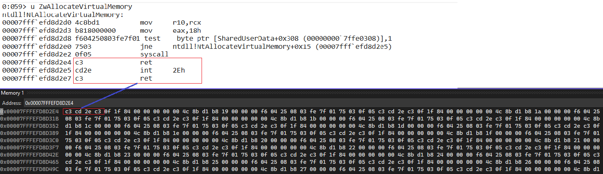
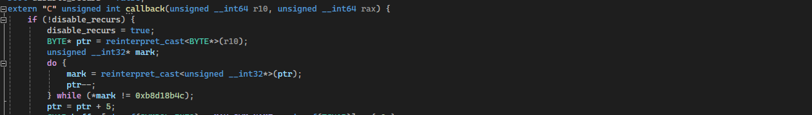
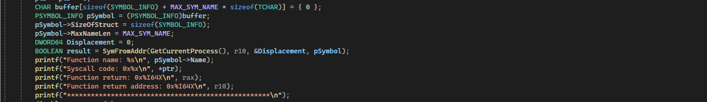
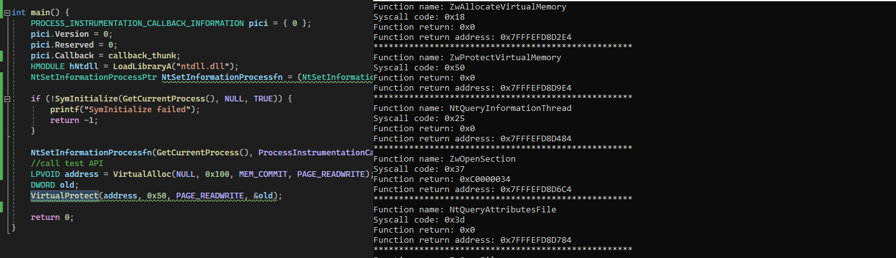

## Nirvana Debugging

### Table of Content
1. [Giới thiệu](#giới-thiệu)
2. [Nirvana Debugging](#nirvana-debugging1)
3. [NtSetInformationProcess](#ntsetinformationprocess)
4. [Callback_thunk và Register syscall function](#callback-register)
5. [Xử lý giá trị của r10 và rax trong callback function](#xử-lý-r10-rax)
5. [Kết luận](#kết-luận)

### Giới thiệu <a name = "giới-thiệu"></a>
Tiếp nối bài viết trước đã tìm hiểu về sử dụng Direct Syscall (link bài viết: [Direct Syscall Blog](https://github.com/vuongle-vigo/WinMalHack-Blog/blob/main/Bypass%20AV%20Hook%20-%20Direct%20Syscall/Bypass%20AV%20Hooking%20with%20Direct%20Syscall.md)), lần này chúng ta sẽ tìm hiểu kỹ thuật Nirvana Debugging, hiểu 1 cách ngắn gọn kỹ thuật này vẫn sẽ cho chúng ta thông tin của API được gọi kể cả nó được gọi bằng phương pháp nào.

### Nirvana Debugging <a name = "nirvana-debugging1"></a>
Kỹ thuật sẽ đặt 1 hook sau khi syscall được thực hiện, tức là kết quả của API đã được trả về, lúc này ta sẽ phân tích kết quả trả về để xem thông tin của API đã được gọi.


</br>
Như chúng ta thấy, **my_callback_hooking_fn** sẽ được đặt ngay sau khi **syscall function** trả về. 

### NtSetInformationProcess
Để có thể đặt được *my_callback_hooking_fn*, sử dụng *NtSetInformationProcess* với *ProcessInformationClass = 40*, giá trị này không được đề cập trong tài liệu của microsoft.
</br>
Cấu trúc của *NtSetInformationProcess*:
```c
typedef NTSTATUS(WINAPI* NtSetInformationProcessPtr)(
	HANDLE ProcessHandle,
	UINT32 ProcessInformationClass,
	PVOID ProcessInformation,
	ULONG ProcessInformationLength
);
```
Trong đó *ProcessInformation* là 1 struct trỏ đến thông tin callback:
```c
typedef struct _PROCESS_INSTRUMENTATION_CALLBACK_INFORMATION 
{
  ULONG Version;		// version 1 = x86, 0 = x64
  ULONG Reserved;		// 0
  PVOID Callback;		// pointer to callback function
} PROCESS_INSTRUMENTATION_CALLBACK_INFORMATION, * PPROCESS_INSTRUMENTATION_CALLBACK_INFORMATION;

```
Dưới đây là code set callback function:
```c
PROCESS_INSTRUMENTATION_CALLBACK_INFORMATION pici = { 0 };
pici.Version = 0;
pici.Reserved = 0;
pici.Callback = callback_thunk;
HMODULE hNtdll = LoadLibraryA("ntdll.dll");
NtSetInformationProcessPtr NtSetInformationProcessfn = (NtSetInformationProcessPtr)GetProcAddress(hNtdll, "NtSetInformationProcess");
NtSetInformationProcessfn(GetCurrentProcess(), ProcessInstrumentationCallback, &pici, sizeof(pici));
```
Trong đó *callback_thunk* là con trỏ đến hàm callback sẽ được gọi, là phần mã asm sẽ được nói đến ở phần dưới.

## Callback_thunk và Register syscall function <a name = "callback-register"></a>
Điều bây giờ cần quan tâm là Sycall function trả về giá trị nào cần quan tâm và 
phân tích giá trị đó thế nào, cùng nhìn lại mã asm của 1 Syscall đã nhắc đến trong bài trước  (link bài viết: [Direct Syscall Blog](https://github.com/vuongle-vigo/WinMalHack-Blog/blob/main/Bypass%20AV%20Hook%20-%20Direct%20Syscall/Bypass%20AV%20Hooking%20with%20Direct%20Syscall.md)):
</br>
```
0:031> u NtWriteVirtualMemory
ntdll!NtWriteVirtualMemory:
00007fff`efd8d710 4c8bd1          mov     r10,rcx
00007fff`efd8d713 b83a000000      mov     eax,3Ah
00007fff`efd8d718 f604250803fe7f01 test    byte ptr [SharedUserData+0x308 (00000000`7ffe0308)],1
00007fff`efd8d720 7503            jne     ntdll!NtWriteVirtualMemory+0x15 (00007fff`efd8d725)
00007fff`efd8d722 0f05            syscall
00007fff`efd8d724 c3              ret
00007fff`efd8d725 cd2e            int     2Eh
00007fff`efd8d727 c3              ret
```
Sau khi gọi syscall, có 2 giá trị được lưu trữ vào 2 thanh ghi *r10* và *rax*, trong đó *r10* là địa chỉ của lệnh ret ngay sau syscall, ở
trên sẽ mang giá trị *00007fff`efd8d724*, còn *rax* sẽ là giá trị trả về của syscall, vì vậy ta cần lấy giá trị 2 thanh
ghi này để phân tích. Để làm được điều này, sử dụng đoạn mã asm dưới đây:
</br>
**callback_thunk.asm**
```
.code
    EXTERN callback : PROC
	callback_thunk proc
        ;save all register
		push rax       
        push rbx       
        push rcx       
        push rdx       
        push rsi       
        push rdi       
        push rbp       
        push rsp

        sub rsp, 20h            ; align stack
        mov rdx, rax            ;arg2
        mov rcx, r10            ;arg1
        call callback
        add rsp, 20h            ; align stack

        pop rsp        
        pop rbp        
        pop rdi        
        pop rsi        
        pop rdx        
        pop rcx        
        pop rbx        
        pop rax

		ret
	callback_thunk endp
end
```
```EXTERN callback: PROC``` là 1 hàm viết trong main.c, trong đó việc truyền rax và r10 vào 2 thanh ghi rdx và rcx nhằm push tham số cho hàm callback. Quy ước gọi hàm được microsoft được đề cập tại đây: 
[x64-calling-convention](https://learn.microsoft.com/en-us/cpp/build/x64-calling-convention?view=msvc-170). Sau bước này hàm callback() sẽ nhận được 2 thanh ghi ta cần lấy, bây giờ chỉ cần phân tích giá trị
2 thanh ghi này để lấy ra thông tin API được gọi.

*Note*: Để gọi đến được callback_thunk, cần khai báo trong main.c như sau: 
</br>
```extern "C" __forceinline PVOID callback_thunk();```

## Xử lý giá trị của r10 và rax trong callback function <a name = "xử-lý-r10-rax"></a>
Thanh ghi *rax* và *r10* sau khi được trả về từ syscall được lưu 2 giá trị như sau:
</br>
- rax lưu kết quả trả về của syscall</br>
- r10 lưu địa chỉ gọi hàm ban đầu của syscall
</br>
Vậy việc đầu tiên ta sẽ debug xem *r10* sẽ trỏ về đâu


*R10* có giá trị hiện tại là *0x00007FFFEFD8D2E4* đang trỏ đến lệnh *C3* như trên, vậy để có thể lấy được mã syscall ở *mov eax, 18h* ta thực hiện tính toán con trỏ đến sau lệnh *mov r10, rcx* (luôn không
	thay đổi) để lấy giá trị này:



Phần còn lại sẽ sử dụng *SymFromAddr* API để lấy tên hàm thông qua con trỏ thanh ghi *R10*:


*Lưu ý*: Để sử dụng được *SymFromAddr*, ta cần khởi tạo trước thông qua hàm dưới đây, cần gọi hàm khởi tạo trước khi gọi NtSetInformationProcess, hạn chế gọi các hàm như LoadLibrary ở giữa *SymFromAddr* và *SymInitialize*
```c
if (!SymInitialize(GetCurrentProcess(), NULL, TRUE)) {
	printf("SymInitialize failed");
	return -1;
}
```
Ngoài ra, ở trong callback có sử dụng 1 số API, theo mình debug với x64dbg thì printf có gọi đến NT WriteFile, vì vậy sẽ tạo ra 1 vòng lặp nữa. Đó là lý do mình sử dụng 
biến *disable_recurs* nhằm tránh việc xảy ra vòng lặp.
## Kết luận <a name = "kết-luận"></a>
Dưới đây là kết quả sau khi mình test thử với *VirtualAlloc* và *VirtualProtect*


Có thể thấy 2 hàm NT trên đã được in ra, kèm theo đó là 1 số hàm của chương trình chạy để kết thúc. Blog tiếp theo mình sẽ nói về sử dụng *NtSetInformationProcess* để inject shellcode vào tiến trình.
Source code mình đã up kèm file trên git tại folder code.
</br>Cảm ơn các bạn đã đọc.